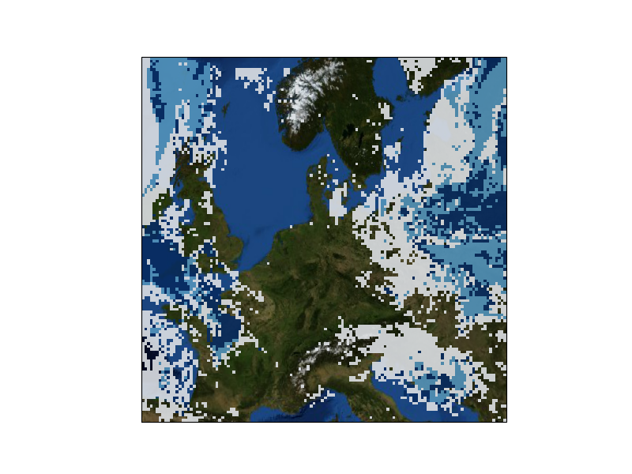

# CloudCast
Repo for the CloudCast: A Satellite-Based Dataset and Baseline for Forecasting Clouds paper

## Training
```python
python run.py --train True --batch_size 2 --num_gpu 2 --data_backend ddp
```

## Testing
```python
python run.py --train False --batch_size 2 --num_gpu 1 --data_backend dp --pretrained_path './models/pretrained.ckpt'
```

## Visualization
Look into the `saved_images` folder. 


